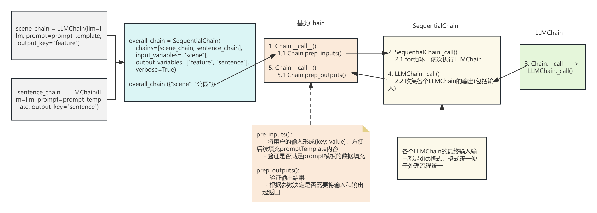

# chains源码分析-关键点说明

## chains流程&类介绍
### 流程&功能介绍

以LLMChain类的使用流程为例，LLMChain的流程中除了prompt相关的类，还涉及到类LLMChain,其基类Chain,以及OpenAI类。
从LLChainl的实例出发，依次经过Chain.__call__(), LLMChain._call()及OpenAI.generate_prompt()等方法。完整一次模型的调用。
其流程图如下:

LLMChain源码流程介绍图

### 各chains类图
几乎所有的chains类都包含一个Chain基类，该基类包括了属性:
- input_keys: 输入的变量，包括了用于填充prompt模板的输入变量和用户输入的其他变量，但必须包含所有的prompt中的变量。
- output_keys: chains的输出变量，默认是text, 用户可以指定输出名称，便于在各个chains之间交互。
- memory: 它在每个链的开头和结尾都被调用。在开始时，内存加载变量并在链中传递它们。最后，它保存所有返回的变量。
- callbacks: 了解chains调用过程中的状态。回调处理程序在对链的调用的整个生命周期中被调用， 从onchain_start开始，以onchain_end或onchain_error结束。 每个自定义链都可以选择性地调用其他回调方法
- tags: 这些标记与当前链相关联，并作为参数传递给“callbacks”中定义的处理程序。您可以使用这些标记来识别链的特定实例及其用例。
- verbose: 是否打印中间的日志到控制台
- metadata: 此元数据与当前链链的每次调用相关联，并作为参数传递给“callbacks”中定义的处理程序。您可以使用这些来识别链的特定实例及其用例。

同样的，该基类也包含了主要的通用方法：
- _call(): 与acall功能相同，_call()使用__call__()开始调用。acall是异步调用。
- acall(): 同上
- apply(): 支持多输入的调用，相当于多次调用_call()
- arun(): 功能同_call()， 
- run(): 同arun()
- prep_inputs(): 将用户的输入形成{key: value}，方便后续填充promptTemplate内容;验证是否满足prompt模板的数据填充
- prep_outputs(): 验证输出结果; 根据参数决定是否需要将输入和输出一起返回

当前的chains对应，会重载_call等方法，针对自身chain对应的特点进行特殊处理。返回结果统一都是dict。保证流程处理的一致性。

LLMChain类图

LLMRequestsChain类图

MapReduceChain类图

OpenAIModerationChain类图

TransformChain类图

## chains pipeline介绍

### chains pipeline说明

chains pipeline是将多个chains对应串联在一起，单个的chains可以看成是某个功能的实现，而pipeline是通过将各个功能串联起来，使用上一个chains的输出作为下一个chain对应的输入完整复杂完整的任务。包括两种：
- 简单的单输入单输出chain pipeline(只允许单个输入，单个输出，顺序链)，对应的类为：SimpleSequentialChain
- 多输入输出的顺序链&指定输入输出的chain pipeline, 对应的类为：SequentialChain

sequential流程介绍

### chains pipeline类图

SequentialChain&SimpleSequentialChain类图

