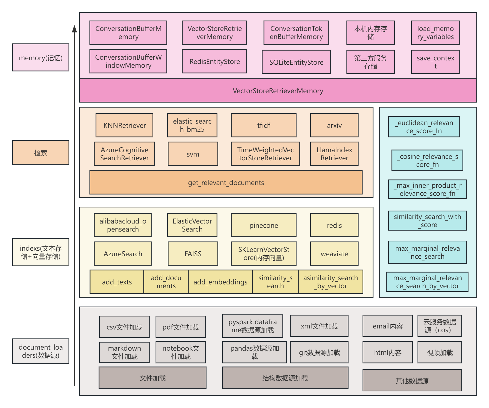

# langchain源码分析-文档加载

## 前言
文档加载本身不是完整的功能，只是配合其他工具必不可少的一环。比如在客服问答场景下，不同的领域应用都需要根据行业特有的资料进行理解并提供问答，就需要从本地加载文档或是从其他存储的地方加载文档，加载之后作为信息检索库，然后根据客户的提问检索相应的信息进行回答。另外不用的企业有不同的运行机制，使用的服务也千差万别，比如有的自建服务器，有的使用云服务，有的喜欢使用markdown文档存储，有的规范使用pdf或doc存储。为应对这种情况就需要支持不同数据源不同格式的加载。

## 文档加载在langchain中的地位
文档的加载是整个应用中的底层工具，通过加载本地或其他数据源，支持客服需要的领域文档内容等的应用场景需求。在langchain中，memory(记忆)、检索、索引和文档加载的关系如下：

- memory(记忆): 用于记忆应用在交互过程中的信息，属于缓存的范畴。缓存内容少时，可以直接使用本机的内存存储；当需要缓存的内容过多时，就需要引入第三方的服务来服务缓存这些数据。而memory模块获取数据数据直接从调用第三方的接口即可。
- 检索：检索是对索引(indexs)信息按指定的策略搜索的模块。很多时候索引本身自带了一定的搜索策略，比如es的bm25搜索策略(依据bm25排序)。在大型系统中，会区分检索和索引服务。一般而言，对于第三方供应商的服务，检索服务和索引是一起提供的，可以看成是一个服务。
- 索引：用于存储文档等内容的内存服务(比如es),本身提供了一些检索策略。
- 文档加载：在构建索引时，需要将本地或离线的信息加载进来，构建索引，对于不同的数据源，需要先进行加载，然后处理加工后构建索引。

## 文档加载的基础内容介绍
在langchain的整个文档加载中，对于很多不同的数据源格式文档，很多都支持了无结构的解析，使用了unstructured第三方package。所以需要先对该package的基本用法有一个了解。
unstructured第三方package是对html、pdf、markdown等文档以无结构的方式解析，可以自动解析出文档中的不同元素，比如markdown中的不同标题的内容，段落信息及列表的item信息等。

### 自动解析文档中的内容
以下代码演示的文档在git上：anal/datasets

```python
# ************** 解析markdown文件 **************
import json
from unstructured.partition.auto import partition
elements = partition(filename="../datasets/unstructured_doc.md")


def print_ele(elements):
    for ele in elements:
        print("category:", f"{ele.category}")
        print("ele:", ele)
        # print("\n")


def convert2dict(elements):
    from unstructured.staging.base import convert_to_dict
    dict_data = convert_to_dict(elements)
    print("dict_data:\n", json.dumps(dict_data, ensure_ascii=False))


def convert2df(elements):
    from unstructured.staging.base import convert_to_dataframe

    df = convert_to_dataframe(elements)
    print("df.type:", type(df))
    print("cols:", list(df.columns))
    print(df.head())

# 打印解析的元素
print_ele(elements)

# 将加载的元素转为dict格式
convert2dict(elements)

# 将加载的数据转为pandas.dataframe格式
# convert2df(elements)
```

```python
# ************* 解析csv文件，每行的各列以换行符链接，不同行使用两个换行符链接，将整个csv文件内容拼接在一起 ****************

from unstructured.partition.csv import partition_csv
# 将csv文件的每行拼接在一起，作为一个doc返回
elements = partition_csv(filename="../datasets/检索数据demo.csv")
print("csv文件内容：")
print(elements[0].text[:200])

```


## 文档加载介绍
该模块是将不来源的文件加载进来，作为一个一个doc(文档，具有完整信息内容的单元)处理，为叙述方便，文中提到的一条内容就对应一个doc。
该模块下几乎涵盖了所有通用的数据源的读取，总共有113个数据源的加载，包括了文本数据的加载、视频数据加载并解析、图片的加载等。支持本地文件加载，也支持在线文件的加载。下面选择具有代表性的几个介绍。
- csv_loader: 将CSV文件加载到文档列表中。 每个文档对应CSV文件的一行。每一行都转换为键/值对，将每行所有的键值对通过换行符拼接在一起作为一个doc，每一行对应一个Document对象，包括了内容和元数据，比如当前数据在第几行。
此外，该模块还支持无结构的数据加载，会自动监测文件
- dataframe: 对应pandas的dataframe，可通过参数“page_content_column”指定使用哪一列作为doc，其他列的信息会作为元信息保存。
- pyspark_dataframe: 支持读取pyspark的dataframe数据，传入的参数是dataframe对象，可通过参数"page_content_column"指定列作为待处理的doc。
- directory: 读取目录下的文件，同通过模式匹配指定读取哪些文件，通过参数loader_cls指定处理文件的类对象（自定义）。
- git: 读取git的内容，每个文件作为一个处理对象doc，参数包括git的clone地址clone_url, 参数地址repo_path, 分支brand和过滤的函数(哪些不读取)
- github: 读取github的issue，读取github的信息需要指定的header和access_token， 可根据issue的状态读取['open', 'closed', 'all']一条issue作为一条doc。
- html: 读取html信息，处理跟csv_loader里边的无结构数据处理一致。
- notebook: 读取notebook信息，整个notebook信息作为一条内容，读取信息包括"cell_type", "source", "outputs"，outputs信息过长，可指定最大截取长度。若cell_type=code, 拼接方式为： `{cell_type}' cell: '{source}'\n with output: '{output[:min_output]}'\n\n"`
  cell_type!=code, 拼接方式为`f"'{cell_type}' cell: '{source}'\n\n"`
- pdf: 加载pdf文件，每个文件为一条doc。pdf是线上的，则先下载到本地，然后以本地文件的方式统一处理。pdf支持不同pdf的解析，包括PDFMiner，pypdfium2，PyPDFParser。
- tencent_cos_directory: 支持从腾讯云的对象存储读取数据，读取目录，然后解析目录下内容。
- tencent_cos_file: 支持从腾讯云的对象存储读取数据，读取文件，会先将文件下载到本地，以无结构化文件处理(参考csv_loader中的无结构化数据处理)。
- email: 支持outlook的信息加载，body部分是待处理的doc。也可以以无结构的方式处理其他邮件格式的加载(参考csv_loader中的无结构化数据处理)
- bilibili: 加载B站视频对应的title及信息，支持多个视频url。通过B站的api获取视频的描述信息。一条视频为一个doc。

## 使用langchain加载文档例子
```python

from langchain.document_loaders import CSVLoader, UnstructuredCSVLoader

loader = CSVLoader(file_path="../datasets/检索数据demo.csv", encoding='utf-8')
docs = loader.load()
print(docs[0])

loader = UnstructuredCSVLoader(file_path="../datasets/检索数据demo.csv", encoding='utf-8')
docs = loader.load()
print(docs[0])
```
