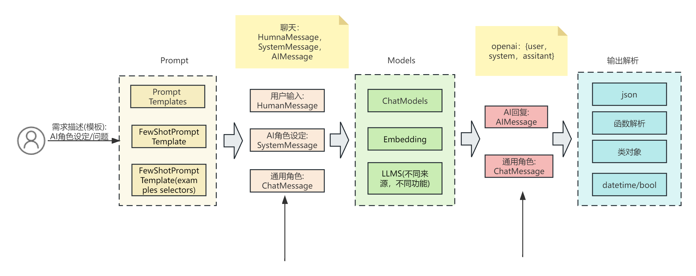

# langchain源码剖析-基础流程总结及补充【5】
该部分内容需要结合对应的视频看

## langchain对话基础流程图

langchain对话基础流程图


- 基础流程包括模型的输入，模型调用及模型输出结果解析。
- 用户输入，可以使用文本信息，生成AIMessage, HumanMessage, SystemMessage类型调用模型。也可以使用prompt模板来生成模型调用的信息，因为prompt模板的方式会让上层应用开发更加高效和设计更加合理，所以重点需要了解这部分内容。
- 用户输入和模型调用中间，通过统一规范的数据格式：HumanMessage, SystemMessage, ChatMessage, 让用户输入和不同模型的调用格式分割开，达到分层管理的目的。
- 模型调用: 这部分主要是以聊天模型为主，接口以统一的格式输入。
- 模型的输出格式通过用户指定，但为了上层应用可以使用，所以引入了输出的解析层。可以将模型输出解析成boolean类型，datetime类型，json格式及类对象格式。

## prompt补充内容
### 普通prompt模板的使用

```python
from langchain import PromptTemplate
from langchain.chat_models import ChatOpenAI
from langchain.prompts import ChatPromptTemplate

# 1.定义模板
prompt_template = "请根据描述特点，帮我取 5个中国名字，特点是：{features}, 以列表形式输出"
prompt_template = ChatPromptTemplate.from_template(prompt_template)
features = "男孩，春暖花开，草长莺飞"

# 2.生成模型输入数据
messages = prompt_template.format_messages(
                    features=features)

# 3.模型调用
chat = ChatOpenAI()
response = chat(messages)
print(response.content)
# 1. 春阳 (chūn yáng) - 意为春天的阳光，寓意春暖花开。
# 2. 草风 (cǎo fēng) - 意为春天的微风，象征草长莺飞的美好景象。
# 3. 花溪 (huā xī) - 意为花开的溪流，寓意春天的美丽景色。
# 4. 莺歌 (yīng gē) - 意为莺鸟的歌声，象征春天的欢乐声音。
# 5. 飞翔 (fēi xiáng) - 意为自由飞翔，代表春天万物复苏的生机。
```

### 带有fewShot example的prompt的使用
创建模板时，支持用户提供部分例子，让模型的输出参考例子给出更为贴合实际场景的结果
- 提供的example较少，可以全部喂给模型

```python

from langchain.schema import SystemMessage
from langchain.prompts import (
    FewShotChatMessagePromptTemplate,
    HumanMessagePromptTemplate,
    AIMessagePromptTemplate,
    SystemMessagePromptTemplate,
)

# 1.给出例子：描述对应场景的特点
examples = [
    {"desc": "天空", "feature": "蓝兰的天空"},
    {"desc": "春天", "feature": "生机盎然的春天"},
    {"desc": "风景", "feature": "风景优美，风光秀丽"},
    {"desc": "演唱会", "feature": "激情兴奋"},
]

# 2.生成例子模板
example_prompt = HumanMessagePromptTemplate.from_template(
    "{desc}"
) + AIMessagePromptTemplate.from_template("{feature}")
few_shot_prompt = FewShotChatMessagePromptTemplate(
    example_prompt=example_prompt,
    examples=examples,
)
print(few_shot_prompt.format())
# 输出:
# Human: 天空
# AI: 蓝兰的天空
# Human: 春天
# AI: 生机盎然的春天
# Human: 风景
# AI: 风景优美，风光秀丽
# Human: 演唱会
# AI: 激情兴奋

# 3. 定义整体prompt
from langchain.chat_models import ChatOpenAI

final_prompt = (
    SystemMessagePromptTemplate.from_template("你是一个场景特点总结大师，给出场景，描述其特点.")
    + few_shot_prompt
    + HumanMessagePromptTemplate.from_template("{desc}")
)

print(final_prompt)
# 输出：
# input_variables=['desc'] output_parser=None partial_variables={} messages=[SystemMessagePromptTemplate(prompt=PromptTemplate(input_variables=[], output_parser=None, partial_variables={}, template='你是一个场景特点总结大师，给出场景，描述其特点.', template_format='f-string', validate_template=True), additional_kwargs={}), FewShotChatMessagePromptTemplate(examples=[{'desc': '天空', 'feature': '蓝兰的天空'}, {'desc': '春天', 'feature': '生机盎然的春天'}, {'desc': '风景', 'feature': '风景优美，风光秀丽'}, {'desc': '演唱会', 'feature': '激情兴奋'}], example_selector=None, input_variables=[], output_parser=None, partial_variables={}, example_prompt=ChatPromptTemplate(input_variables=['desc', 'feature'], output_parser=None, partial_variables={}, messages=[HumanMessagePromptTemplate(prompt=PromptTemplate(input_variables=['desc'], output_parser=None, partial_variables={}, template='{desc}', template_format='f-string', validate_template=True), additional_kwargs={}), AIMessagePromptTemplate(prompt=PromptTemplate(input_variables=['feature'], output_parser=None, partial_variables={}, template='{feature}', template_format='f-string', validate_template=True), additional_kwargs={})])), HumanMessagePromptTemplate(prompt=PromptTemplate(input_variables=['desc'], output_parser=None, partial_variables={}, template='{desc}', template_format='f-string', validate_template=True), additional_kwargs={})]

# 4.模型调用
chat = final_prompt | ChatOpenAI(temperature=0.0)
resp = chat.invoke({"desc": "图书馆"})
print(resp.content)
# 输出：安静祥和，知识的殿堂

resp = chat.invoke({"desc": "老鹰"})
print(resp.content)
# 输出：高飞翱翔的老鹰
```

### 带有较多example的prompt使用(需要选择example)
- 提供的example较大, 需要根据实际情况选择部分喂给模型
- 固定prompt长度的example选择: LengthBasedExampleSelector
- 重叠法选择: NGramOverlapExampleSelector; 参考文档:"https://www.nltk.org/_modules/nltk/translate/bleu_score.html", "https://aclanthology.org/P02-1040.pdf"
- 语义相关性example选择: SemanticSimilarityExampleSelector; 说明: 依赖VectorStore
- 最大边际相关性样本选择: MaxMarginalRelevanceExampleSelector; 文档: https://arxiv.org/pdf/2211.13892.pdf

```python

from langchain.schema import SystemMessage
from langchain.prompts import (
    FewShotChatMessagePromptTemplate,
    HumanMessagePromptTemplate,
    AIMessagePromptTemplate,
    SystemMessagePromptTemplate,
)
from langchain import PromptTemplate
from langchain.prompts.example_selector import (
    LengthBasedExampleSelector,
    MaxMarginalRelevanceExampleSelector,
    NGramOverlapExampleSelector,
)

# 1.例子: 描述对应场景的特点
examples = [
    {"desc": "天空", "feature": "蓝兰的天空"},
    {"desc": "春天", "feature": "生机盎然的春天"},
    {"desc": "风景", "feature": "风景优美，风光秀丽"},
    {"desc": "演唱会", "feature": "激情兴奋"},
]

example_formatter_template = """
desc: {desc}
feature: {feature}\n
"""

example_prompt = PromptTemplate(
    input_variables=["desc", "feature"],
    template=example_formatter_template,
)

# 定义固定长度选择例子的类， 实际测试时，可以修改max_length测试
example_selector = LengthBasedExampleSelector(
    examples=examples,
    example_prompt=example_prompt,
    max_length=10
)
output = example_selector.select_examples({"desc": "演唱会"})
# 输出(选择例子后)
# [{'desc': '天空', 'feature': '蓝兰的天空'}]

from langchain.prompts import FewShotPromptTemplate
from langchain.prompts import HumanMessagePromptTemplate

from langchain.schema.messages import (
    AIMessage,
    BaseMessage,
    ChatMessage,
    FunctionMessage,
    HumanMessage,
    SystemMessage,
)

# 2.合成例子和输入的模板
dynamic_prompt = FewShotPromptTemplate(
    # We provide an ExampleSelector instead of examples.
    example_selector=example_selector,
    example_prompt=example_prompt,
    prefix="你是一个场景特点总结大师，给出场景，描述其特点，参考下面的例子.",
    suffix="desc: {desc}\n feature:",
    input_variables=["desc"],
    example_separator="\n\n",
)
content = dynamic_prompt.format(desc="图书馆")
messages = [HumanMessage(content=content)]
print(messages)
# 输出：[HumanMessage(content='你是一个场景特点总结大师，给出场景，描述其特点，参考下面的例子.\n\n\ndesc: 天空\nfeature: 蓝兰的天空\n\n\n\ndesc: 图书馆\n feature:', additional_kwargs={}, example=False)]

# 3.模型调用
from langchain.chat_models import ChatOpenAI
chat = ChatOpenAI()
resp = chat(messages)
print(resp)
# 输出：AIMessage(content='安静的图书馆', additional_kwargs={}, example=False)
```

### 手动拼接信息调用模型
- 手动拼接模型信息
- 根据不同类型的信息，使用不用的信息类型

```python

from langchain.schema import SystemMessage
from langchain.prompts import (
    FewShotChatMessagePromptTemplate,
    HumanMessagePromptTemplate,
    AIMessagePromptTemplate,
    SystemMessagePromptTemplate,
)
from langchain import PromptTemplate
from langchain.prompts.example_selector import (
    LengthBasedExampleSelector,
    MaxMarginalRelevanceExampleSelector,
    NGramOverlapExampleSelector,
)

# 1.例子定义: 描述对应场景的特点
examples = [
    {"desc": "天空", "feature": "蓝兰的天空"},
    {"desc": "春天", "feature": "生机盎然的春天"},
    {"desc": "风景", "feature": "风景优美，风光秀丽"},
    {"desc": "演唱会", "feature": "激情兴奋"},
]

example_formatter_template = """
desc: {desc}
feature: {feature}\n
"""

example_prompt = PromptTemplate(
    input_variables=["desc", "feature"],
    template=example_formatter_template,
)

print(example_prompt)
# 输出：input_variables=['desc', 'feature'] output_parser=None partial_variables={} template='\ndesc: {desc}\nfeature: {feature}\n\n' template_format='f-string' validate_template=True

# 2.合成例子和输入的模板
example_selector = LengthBasedExampleSelector(
    examples=examples,
    example_prompt=example_prompt,
    max_length=20
)
output = example_selector.select_examples({"desc": "演唱会"})
print(output)
#输出: [{'desc': '天空', 'feature': '蓝兰的天空'}, {'desc': '春天', 'feature': '生机盎然的春天'}]

from langchain.schema.messages import (
    HumanMessage,
    SystemMessage,
)

# 3.手动生成例子作为模型输入
sys_message = "你是一个场景特点总结大师，给出场景，描述其特点，参考下面的例子.,使用简短的词描述其特点"
for example in output:
    sys_message += "{}: {}\n".format(example["desc"], example["feature"])
content = "图书馆"
messages = [SystemMessage(content=sys_message), HumanMessage(content=content)]
print(messages)
# 输出: [SystemMessage(content='你是一个场景特点总结大师，给出场景，描述其特点，参考下面的例子.,使用简短的词描述其特点天空: 蓝兰的天空\n春天: 生机盎然的春天\n', additional_kwargs={}), HumanMessage(content='图书馆', additional_kwargs={}, example=False)]

# 4. 模型调用
from langchain.chat_models import ChatOpenAI
chat = ChatOpenAI()
resp = chat(messages)
print(resp)
# 输出: content='安静的图书馆' additional_kwargs={} example=False

print(resp.content)
# 输出: 安静的图书馆
```
