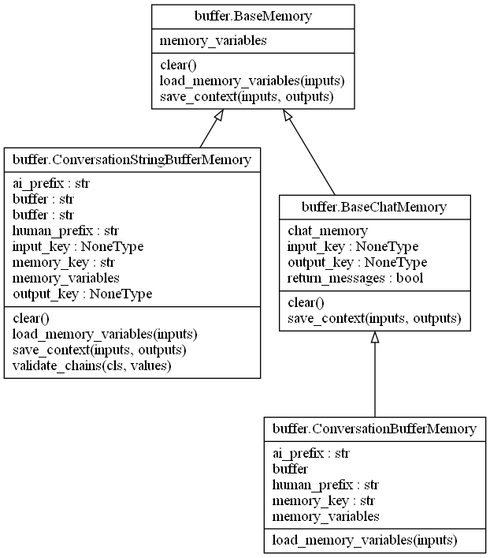

# memory-模块介绍
在体验ChatGPT的时候，我们会碰到对话多轮后，AI的在后面的回答跟前面的内容相矛盾。这是因为AI没有记录之前的信息。ChatGPT模型本身是没有记忆功能的，我们对话通过对话框对话感觉有记忆是因为对聊天信息额外做了缓存，将缓存的信息作为历史信息一起发送给ChatGPT，从而保证聊天的连贯性。

然而，随着对话轮数的增长以及ChatGPT最大token长度的限制，就需要对历史聊天信息进行筛选，保留相关的信息作为最新的历史聊天记录。如果保留相关信息的信息就是memory的机制。

在langchain中，提供了两大类存在会话信息的方法: 1) 使用内存存储历史会话信息，比如直接存储历史信息、按窗口大小存储最近K轮的历史信息、按token长度存储最近的聊天信息等；2）将历史聊天记录存储在第三方的向量数据库中, 在每一轮新的对话中，会根据用户的输入，从向量数据库中匹配最相似度的k组对话，同最新的用户输入一同发送给模型。第二类方法在大型应用中较为常见，该部分与indexs(索引)和retrivers(检索)相关,该部分内容会在后续介绍。

## 基于内存的模块介绍

基于内存memory模块下包含了多个类，这类都继承自BaseMemory、BaseChatMemory、BaseChatMessageHistory及BaseModel。

#### BaseMemory介绍
该类是抽象类，主要包含1)memory_variables属性(方法),返回内容中历史信息中key列表；2) load_memory_variables方法，给定文本输入时，返回key-value的记忆信息给chain使用；3) save_context方法，保存chain调用的上下文信息。

#### BaseChatMessageHistory: 
抽象类，包含属性messages: List[BaseMessage]， 列表元素为历史信息；包含方法:
- 1）add_user_message, 在聊天中，分为用户输入、系统信息、AI信息，该接口专门添加用户的信息，对应的类为HumanMessage;
- 2) add_ai_message方法，添加AI的回答信息；
- 3）add_message方法，通用的添加信息方法，是抽象方法。有子类具体实现。

#### BaseChatMemory
该类继承BaseMemory，包含属性chat_memory: BaseChatMessageHistory，用于update历史信息；output_key、input_key分别对应AI的输出和用户的用户。方法包括:
- save_context(): 将会话信息保存到用户信息或AI模型的输出保存起来。

#### BaseEntityStore
第三方向量索引的基类，提供了一系列检索的抽象方法，主要是增删查、是否存在、删除所有信息等接口。

### 基于内存的常用类及接口及功能介绍
需要强调一点，这里说的是会话历史信息的保存，不能简单的理解是聊天场景。其他场景也可以使用，比如有一个很大的文档，无法直接喂给模型，则需要进行切割，对每一部分进行处理，处理之后对内容进行检索，检索可能前后两次有相关性，这个也符合会话场景。
- ConversationBufferMemory: 简单的将历史信息保存到内存，知道内存爆炸。
- ConversationStringBufferMemory: 功能同ConversationBufferMemory，重载了save_context方法。
- ConversationBufferWindowMemory: 增加一个窗口信息，保留最近的K条信息。
- ConversationSummaryMemory: 保存用户与AI的对话内容摘要信息
- ConversationSummaryBufferMemory: 存储用户和AI的对话内容的摘要，并根据token长度来确定何时来确定何时刷新交互。
- ConversationTokenBufferMemory: 根据token的长度保存用户和AI的对话内容。
- CombinedMemory: 将多个对话历史信息保存的方式以list的方式组合，保存的信息是一样的，这样可以保证历史信息的高可用和并发。

### 基于第三方向量索引的类接口及功能介绍
带有Chat字样的类是为聊天设计的，主要保存聊天的历史信息。实现了add_message方法，不同的存在实现对应的逻辑。通过message方法(属性)获取历史信息。
- FileChatMessageHistory: 通过文件存在聊天历史信息
- RedisChatMessageHistory: 使用redis存储聊天信息
- SQLChatMessageHistory: sql存储
- MongoDBChatMessageHistory: mongoDb存储聊天信息
- FirestoreChatMessageHistory: google的Firestore
- CassandraChatMessageHistory: Cassandra存储
- CosmosDBChatMessageHistory: 微软的Azure CosmosDB存储

- VectorStoreRetrieverMemory: 向量存储&检索工具，可以设计通过什么方式检索历史信息。
- ZepMemory: 将聊天信息持久化到Zep Long-term Memory Server

## 主要类关系图

ConversationBufferMemory/ConversationStringBufferMemory类图

ConversationBufferWindowMemory类图

entity类图

summary_buffer类图

redis类图

其他的类图在anal/memory/imgs_classes下，可自行查看。
