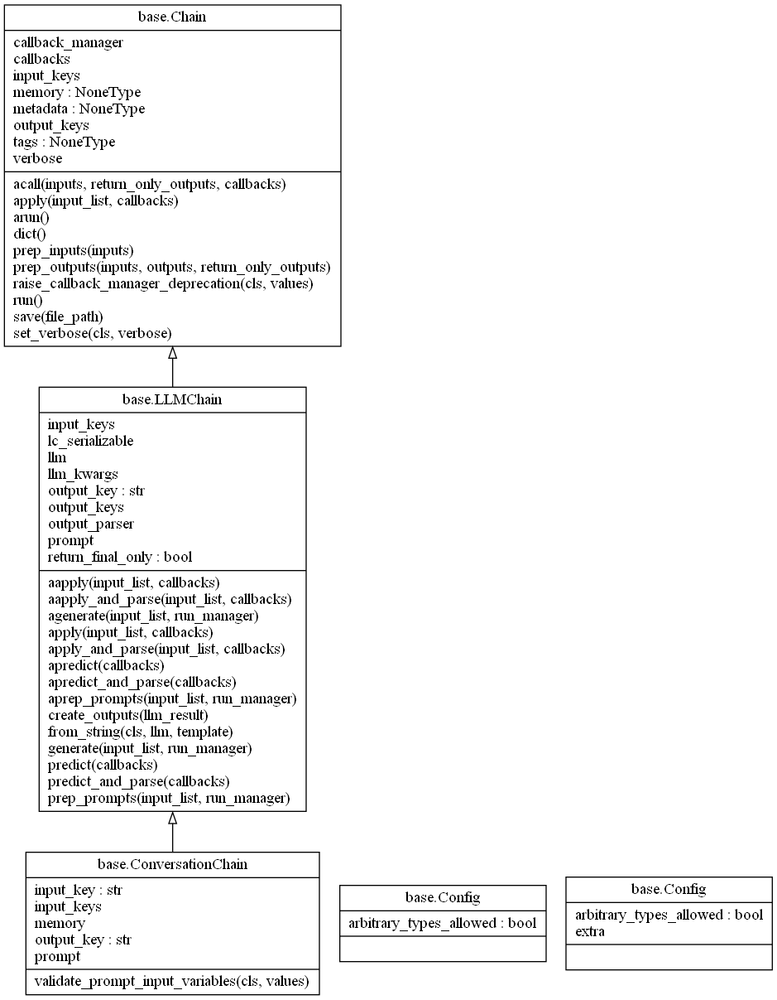

# memory-运行流程及案例介绍

memory的部分需要结合chain的执行流程才能更好的分析memory的运行流程，这里以conversationChain的流程为例，介绍memory的使用情况。
以ConversationBufferWindowMemory, ChatOpenAI在ConversationChain链的使用为例，如下:
```python
from langchain.chat_models import ChatOpenAI
from langchain.chains import ConversationChain
from langchain.memory import ConversationBufferWindowMemory

llm = ChatOpenAI(temperature=0.0)
memory = ConversationBufferWindowMemory(k=1)
conversation = ConversationChain(
    llm=llm, 
    memory = memory,
    verbose=False
)
conversation.predict(input="What is 1+1?")
conversation.predict(input="What is my name?")
```

从上述的这里例子分析，ConversationChain的类关系如下:

从图中可以看到，其继承了LLMChain，而LLMChain继承了Chain，其LLMChain的执行流程可以参考我关于chain的使用[B站](https://www.bilibili.com/video/BV1fF41197XT/?spm_id_from=333.999.0.0) 或[文章](https://zhuanlan.zhihu.com/p/648239063)

使用了memory的chain的流程如下：

结合chain模块执行流程，从图中可以看到，整个执行的流程其实除来入口调用predict及标红部分，其他执行的步骤和流程一样。标红部分就是memory的使用部分。主要包括load_memory_variables和save_context

### memory.load_memory_variables()
- 读取历史信息列表chat_memory:  BaseChatMessageHistory 
- 截取最新的k*2条信息(k轮对话包含，k条用户信息，k条AI信息)
- 将信息解析并拼接成str，以{"history"： str}返回，用于填充prompt

### memory.save_context()
- 先将inputs和ouputs解析出用户输入和AI返回结果
- 调用chat_memory:  BaseChatMessageHistory的add_user_message保存用户输入 
- 调用chat_memory:  BaseChatMessageHistory的add_ai_message保存AI返回结果

## 其他结合memory使用chain的例子
#### ConversationBufferMemory的使用
```python
from langchain.chat_models import ChatOpenAI
from langchain.chains import ConversationChain
from langchain.memory import ConversationBufferMemory

llm = ChatOpenAI(temperature=0.0)
memory = ConversationBufferMemory()
conversation = ConversationChain(
    llm=llm, 
    memory = memory,
    verbose=True
)
conversation.predict(input="Hi, my name is Andrew")
conversation.predict(input="What is 1+1?")
conversation.predict(input="What is my name?")

```

#### ConversationBufferWindowMemory的使用
```python
from langchain.chat_models import ChatOpenAI
from langchain.chains import ConversationChain
from langchain.memory import ConversationBufferWindowMemory

llm = ChatOpenAI(temperature=0.0)
memory = ConversationBufferWindowMemory(k=1)
conversation = ConversationChain(
    llm=llm, 
    memory = memory,
    verbose=False
)
conversation.predict(input="What is 1+1?")
conversation.predict(input="What is my name?")
```

#### ConversationTokenBufferMemory
```python
# !pip install tiktoken
from langchain.chat_models import ChatOpenAI
from langchain.chains import ConversationChain

from langchain.memory import ConversationTokenBufferMemory
from langchain.llms import OpenAI
llm = ChatOpenAI(temperature=0.0)
memory = ConversationTokenBufferMemory(llm=llm, max_token_limit=30)
memory.save_context({"input": "AI is what?!"},
                    {"output": "Amazing!"})
memory.save_context({"input": "Backpropagation is what?"},
                    {"output": "Beautiful!"})
memory.save_context({"input": "Chatbots are what?"}, 
                    {"output": "Charming!"})

memory.load_memory_variables({})
conversation = ConversationChain(
    llm=llm, 
    memory = memory,
    verbose=False
)
conversation.predict(input="What is 1+1?")
conversation.predict(input="What is my name?")

```

#### ConversationSummaryMemory
```python
from langchain.memory import ConversationSummaryBufferMemory
from langchain.chat_models import ChatOpenAI
from langchain.chains import ConversationChain

schedule = "There is a meeting at 8am with your product team. \
You will need your powerpoint presentation prepared. \
9am-12pm have time to work on your LangChain \
project which will go quickly because Langchain is such a powerful tool. \
At Noon, lunch at the italian resturant with a customer who is driving \
from over an hour away to meet you to understand the latest in AI. \
Be sure to bring your laptop to show the latest LLM demo."

llm = ChatOpenAI(temperature=0.0)

memory = ConversationSummaryBufferMemory(llm=llm, max_token_limit=100)
memory.save_context({"input": "Hello"}, {"output": "What's up"})
memory.save_context({"input": "Not much, just hanging"},
                    {"output": "Cool"})
memory.save_context({"input": "What is on the schedule today?"}, 
                    {"output": f"{schedule}"})


conversation = ConversationChain(
    llm=llm, 
    memory = memory,
    verbose=True
)

conversation.predict(input="What would be a good demo to show?")

print(memory.load_memory_variables({}))
```