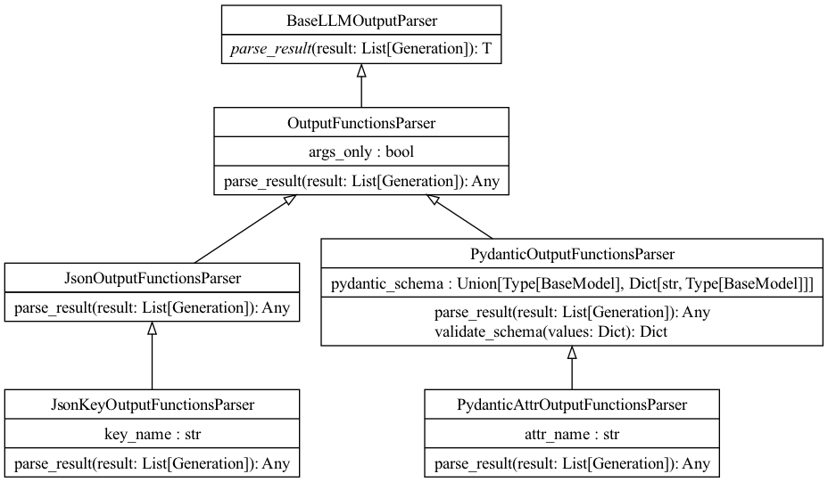

# output_parsers说明
output_parsers是对聊天模型及其他模型输出结果的解析，因为理论上模型输出的结构都是字符串(如json格式的字符串),通过该模块可以将模型的输出按指定的格式输出，比如json格式，boolean格式，也可以是自定的类结构格式。这样做主要是为了方便与生成应用交互。比如所有的模型输出都通过该模块转换成类结构输出，那么上层应用就可以根据类结构获取对应的属性字段。类结构字段定义好之后，模型的调用和具体的上层应用就可以分离开，两者按定义好的中间数据层(类结构)独立开发，可以大大提升效率。

## output_parsers类介绍
output_parsers模块下包含了多个类，这类都继承自BaseOutputParser，
- BooleanOutputParser: 将文本字符串解析为bool类型，该文本串需要是 'yes'或'no'，不区分大小写(会统一转化为大写字符判断)。
- CombiningOutputParser: 组合了多个输出的解析器(list列表)，将文本通过'\n\n'分隔后，与解析器一一对应，分别调用对应的解析器解析输出结果。
- DatetimeOutputParser: 将文本转成成datetime格式"%Y-%m-%dT%H:%M:%S.%fZ"。
- EnumOutputParser: 将文本串解析为枚举类型。
- SimpleJsonOutputParser: 将文本串简单处理后(去除前面的```等符号), 转换为json格式。
- CommaSeparatedListOutputParser: 将文本串通过’, ‘分隔，转为list格式返回。
- OutputFunctionsParser: 该类是对支持openai推出的函数调用的解析，主要是根据模型返回的函数名和参数进行解析，解析成对应的格式，可以是字符串的函数名，可以是json格式包含函数名和参数等。
- PydanticOutputFunctionsParser: 通过pydantic工具将模型返回的函数，解析成类结构。便于上层应用使用。
- PydanticOutputParser: 对模型输出的数据，解析成对应的类。在解析是需要提前定义好类的结构，参考案例演示中的例子。
- GuardrailsOutputParser: 该类是在PydanticOutputParser做的改进，会对解析出来的结果增加了强校验的功能。
- RegexParser/RegexDictParser: 通过正则解析模型输出的结果，可以是单个正则解析，也可以是对字段格式中的每个结果进行正则解析。
- RetryOutputParser: 包含了输出解析器，当解析失败是，会继续调用模型重新解析。
- OutputFixingParser: 功能基本同RetryOutputParser
- StructuredOutputParser: 根据提前定义的返回字段，进行解析，底层就是调用json的解析方式，然后判断对应的变量是否在json结果中。

### output_parsers的通用函数说明
几乎所有的output类都包含一个BaseOutputParser基类，该基类没有属性，定义了若干方法：
- parse_result(): 将候选模型生成的列表解析为特定格式。参数是一个模型的输出(list)，理解为一个模型的多个候选集输出。
- parse(): 将单个模型的数据解析为指定的格式，是抽象方法，需要具体格式类实现。
- parse_with_prompt(): 根据上下文信息，解析模型的输出结果。需要传入解析的模板。

对于每个具体的输出解析类，最主要的是实现上述三个方法，而用的最多的是parse方法。各输出解析类的最大差一点也是在parse的实现。

## output_parsers的类关系图

BooleanOutputParser类图


CombiningOutputParser类图


DatetimeOutputParser类图


CommaSeparatedListOutputParser类图


OutputFunctionsParser类图



其他的类图在anal/output_parsers/imgs_classes下，可自行查看。
